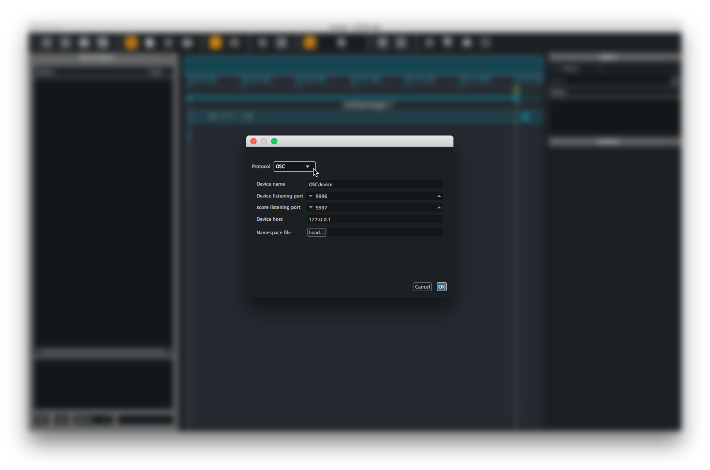

# Writing your first Score scenario

In this short tutorial, we will write a simple scenario in Score. This should provide the basis to get familiar with Score interface and general workflow.

Here we will use a simple frequency modulation-based synthesiser provided with Score documentation. Assuming you already have Pd or Max installed on you computer, you may use the Pd or Max version of this patch.

> If frequency modulation synthesis does not sounds like fun to you, you may follow this tutorial using your favourite Open Sound Control (OSC) application. In that case, just follow the various steps and adjust the various options (OSC configuration, namespace configuration, etc.) to your application.

Since we will use Score to control a distant application, we first need to setup our OSC device in Score so they can communicate properly.

## Adding your device

Once launched, Score opens with an empty window. To setup our OSC device, click the `+` button at the bottom left of the *Device explorer* pane or use cmd + B (on MacOS) / ctrl + B (on Windows) shortcut. This prompts a configuration window where we can setup various protocols informations.

The configuration window provides a list of all protocols supported in Score. Here we will select OSC from the menu. This bring the various option fields needed to setup the communication between our application and Score:

* A name for the device (used for display only)
* The network port your application will receive OSC messages from
* The network port Score will receive OSC messages from (assuming your application can echo back its parameters current state)
* IP address of the computer of your application is running on.

Our simple patch example is built to use Score's OSC default ports and address so you can leave the above fields untouched. Then click the `load` button to load the `fm-osc-example.device` namespace file of our device. Press the return key or click the `OK` button. The Device explorer should now display our device named `OSCdevice` along with all its parameters and various attributes settings in a tree-like view.

Should you need to modify the OSC setup of your device, right-click on your device name in the Device explorer pane and choose `Edit`.

> The namespace file we just loaded is a json file describing all parameters addresses of a device we want to send values to. If using another OSC application for this tutorial, you may either use the learn feature available when right-clicking your device name in the Device explorer, or manually declare the namespace of your application. In the later case, please see the [How to manually declare a namespace](../howtos/manual_namespace_setup.html) documentation page.

> Note how selecting a node containing parameters in the namespace will select all parameters below

## 