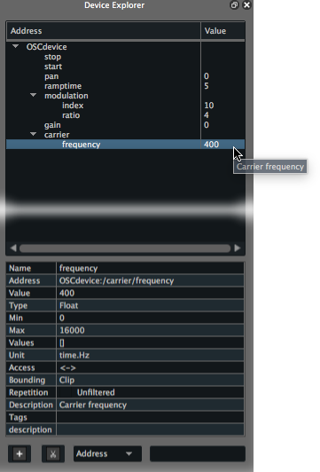
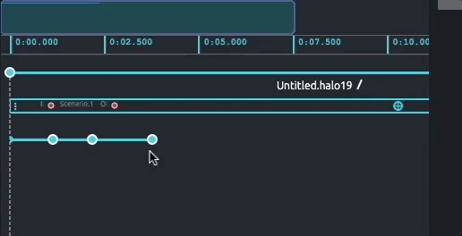
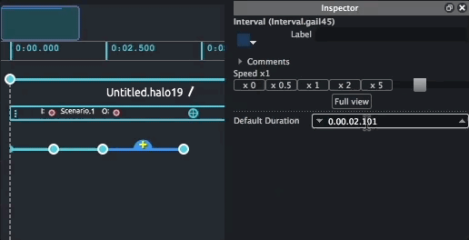
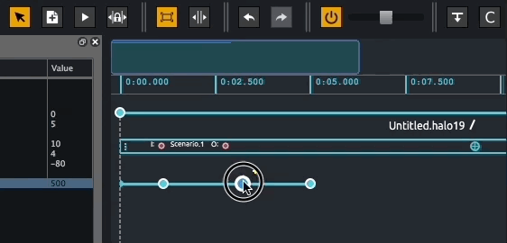
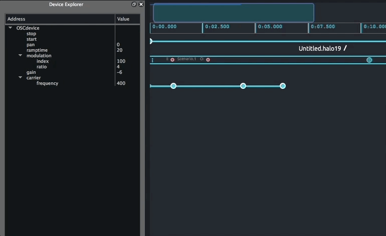
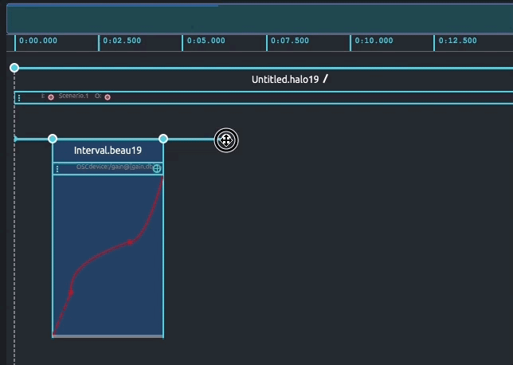
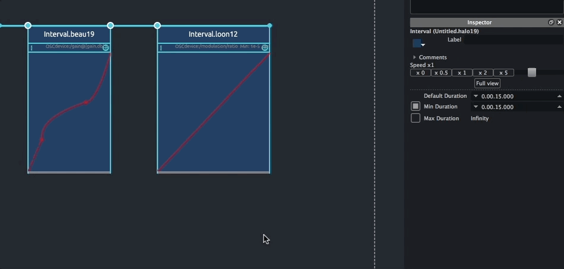

# Writing your first Score scenario

In this short tutorial, we will write a simple scenario in Score. This should provide the basis to get familiar with Score interface and general workflow.

Here we will use a simple frequency modulation-based synthesizer provided with Score documentation. Assuming you already have Pd or Max installed on you computer, you may use the Pd or Max version of this patch.

> If frequency modulation synthesis does not sounds like fun to you, you may follow this tutorial using your favorite Open Sound Control (OSC) application. In that case, just follow the various steps and adjust the various options (OSC configuration, namespace configuration, etc.) to your application.

Since we will use Score to control a distant application, we first need to setup our OSC device in Score so they can communicate properly.

## Adding your device

Once launched, Score opens with an empty window. To setup our OSC device, click the `+` button at the bottom left of the *Device explorer* pane or use cmd + B (on MacOS) / ctrl + B (on Windows) shortcut. This prompts a configuration window where we can setup various protocols informations.

The configuration window provides a list of all protocols supported in Score. Here we will select OSC from the menu. This bring the various option fields needed to setup the communication between our application and Score:

* A name for the device (used for display only)
* The network port your application will receive OSC messages from
* The network port Score will receive OSC messages from (assuming your application can echo back its parameters current state)
* IP address of the computer of your application is running on.

Our simple patch example is built to use Score's OSC default ports and address so you can leave the above fields untouched. Then click the `load` button to load the `fm-osc-example.device` namespace file of our device. Press the return key or click the `OK` button. The Device explorer should now display our device named `OSCdevice` along with all its parameters and various attributes settings in a tree-like view.

Should you need to modify the OSC setup of your device, right-click on your device name in the Device explorer pane and choose `Edit`.

> The namespace file we just loaded is a json file describing all parameters addresses of a device we want to send values to. If using another OSC application for this tutorial, you may either use the learn feature available when right-clicking your device name in the Device explorer, or manually declare the namespace of your application. In the later case, please see the [How to manually declare a namespace](../howtos/manual_namespace_setup.md) documentation page.

## Setting an initial state

We will start by setting an *init* state for our scenario. In this case, the default state of our device will be perfect as an init state so we will just store its parameters current value in the scenario initial event.

The easiest way to do this is to select the parameter to store from the Device explorer pane then drag them on the scenario initial event. Selection can be done using regular mouse & key combos. Hence we can select the 'pan' parameter then shift + click on the 'frequency' parameter to select both these addresses and all between them in the tree view. For the sake of this tutorial, we will also make sure that DSP processing is turned off by default in Pd. With the current selected addresses, cmd + click (on MacOS) or ctrl + click (on Windows) on the 'stop' parameter then drag this full selection on the initial event as shown below. 

> Note that selecting a node containing parameters in the namespace will select all parameters below it (ie. clicking 'modulation' selects both 'modulation/index' & 'modulation/ratio')

When done, you can see that the scenario initial event (the blue dot on the scenario timeline) is now displayed with a surrounding white circle. If you click on the state we just created, you can see in the inspector all the stored values and their associated value.

> Having set this init state, now when reinitializing the scenario (using `cmd + return` on macOS or `ctrl + return` on Windows), Score will automatically recall our device's state so it is ready to go !

## Storing states of your device

We will now store more states in our scenario and organize them on the timeline.

We will start with a simple state used to turn Pd's DSP processing on. As we previously did, let's grab the 'start' parameter and drop it on Score timeline. As you are hovering the timeline with the 'start' parameter, notice that a grey dashed line connected to the first event on the scenario is drawn. [Remember that events and processes needed to connected to a time source](time_approach.md) so they get properly executed as time progress in the scenario. By default, Score then offers to automatically connect events sequentially.

Again, if you select the created state, you can see in its inspector that the 'start' parameter has been saved.

You can select this event and move it around on the timeline. Moving it horizontally lets you adjust its position on the timeline (hence when the stored parameters will get sent when playing the scenario). Vertical position has no but graphical purpose for the execution of our scenario. We can now store more states.

The device used in this tutorial only provides unidirectional communication (our device can only receive message from Score) so we will use the device explorer as a simple remote interface. To do so, just double-click on the value fields you want to change and type the desired value. We will for example raise the gain up to 0 dB, set the 'modulation/index' to 100 and set the 'ramptime' to 20 ms.You may now store this new state just as we did above.

> When using bidirectional protocol between Score and your device (ie. OSCquery), Score will listen to the parameters changes in the device. You may then make changes right from your device or using your favorites controllers (hence avoid fastidiously typing values by hand)

Select the addresses you want to store then drag them on the timeline. You will see that Score offers to connect this new event to the event it is most aligned with. Make sure to connect this new event to the one we previously created.

Now follow your inspiration and store on the timeline as many of your device's states or [fine tune them](../howtos/update_state.md) as you wish. 

Press the `spacebar` to start playing our scenario and recalling these snapshots as time moves along the timeline. You may pause the execution of our scenario pressing the `spacebar` again or stop it using `return` key (remember of can use `cmd + return` or `ctrl + return` to stop and fully reinitialize the scenario).

## Adjusting events in time

We saw that moving events along allows to adjust events' position on the timeline. But a few important points are worth to be added to the topic. One of Score's strength resides in some advanced features to control time flow in a highly precise way. This is especially useful as your scenario grows and as the various media dealt with your device (sound generation or processing, video, lights) induces complex temporal relationship between events.

If you select the last state you stored in your scenario, you can move it on the timeline as previously done. Now select a state in the middle of a sequence of events and see what happens: Score will preserve the length of the interval to the following event and *move* all following events in your scenario subsequently. This is extremely useful when wanting to adjusting things locally (ie. Parts of a scene of a theatre piece while rehearsing ) while maintaining the rest of the structure untouched.

You may also adjust time between events with a particular length (ie. The time it takes for some curtains to get drawn on stage). To do so, select an interval by clicking on it in the timeline, then from its inspector, type the desired length.

There are some times when you may want to move some event without moving all following events, though. This can be done by moving things around using the `lock mode`. To do so, click on the lock button in the toolbar and move the selected event on the timeline (or select an event to move while holding the `option` key on macOS or `alt` key on Windows).

## Writing processes

Now that we covered the basis of Score workflow, we may add a little more animation to our scenario using a few of the many processes provided in Score.

Processes are different widgets allowing to control some parameter's value over a given amount of time (the length given by an interval drawn in the scenario). Let start by adding a gentle fade in in our scenario. To do so, we will add an automation on our 'gain' parameter. From the Device explorer, select the 'gain' parameter and let's drag & drop it over the interval linking the first and second states on the timeline (that is, the one containing the 'start' message and the one raising the 'gain' to 0 dB , etc.). Score automatically creates a break-point function automation.

You may fine-tune your break-point function and more points by double-clicking in the automation background, move points by selecting points then move them around or add curve using `shift + drag` on a segment.

There are various types of functions for the automation process. We will add a little more fun to our scenario using another one of these.

In this second example, we want to create an automation following the last state of our device that we store in the scenario. Since there is no interval already in place, we first need to create one so we can attach a process to it. To do so, select the last stored state in our scenario. You can see that a little yellow '+' sign popup next to the event. `click + drag` on the plus sign to draw an interval in the scenario of a desired length, then release your mouse. We thus created an interval (without storing state at its right end).

We may now drag the parameter to automate as we previously did. Although, while dragging and dropping parameters is a handy shortcut, there are situations (when using generator processes) where we cannot benefit from these so we will go through the whole process by hand.

Click on the interval we just created to bring a little '+' sign attached to the interval. Click that '+' sign to open up the processes library. The window displays different banks each containing various processes. From the 'automations' bank, choose 'automation (float)'. Double-click (or click the '+' button) then close the window. We now created an automation.

We first have to set the name of the parameter we want to automate. Click on the automation header (displaying "Automation" as a greyed out label) to bring its inspector. From the Device explorer, select the parameter to automate (ie 'modulation/ratio') and drag it over to 'Address' field the automation inspector. The automation will now use this parameter as destination. 

The automation process offers a number of embedded function (standard easing functions, waveforms, etc.). Hence, rather than adding points and curve, here we will use the noise generator. In the automation box, select the red segment then right-click. From the function contextual menu, navigate through the 'Automation (float) > Type' section then choose 'noise'. Score now filled our automation process with a random function.

One more thing we may want to do before listening to our composition. When doing automation, Score use by default the min/max values of the automated parameter. Here, we will adjust these bounds so the automation runs in a user-defined range.

From the automation inspector, check the min and max textfield and set desired values. We will arbitrary use a minimum value of 5 and maximum value of 9. But feel free to experiment and adjust to your taste!

## Summary

We now covered the major features of the Score workflow: setting up your devices network, storing & recalling snapshots, writing automations for the parameters of your device, write precise temporal structure.

Score offers a number of other features depending on the protocols used to communicate with your devices, handy shortcuts to ease the writing of complex performances or installations, vast collection of available processes that will get covered in the following on the documentation.

In the mean time, this should get you the needed basis to start with Score scenario authoring.

You may now sit comfortably, relax and enjoy your composition. Or just start experimenting !

