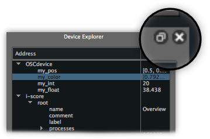
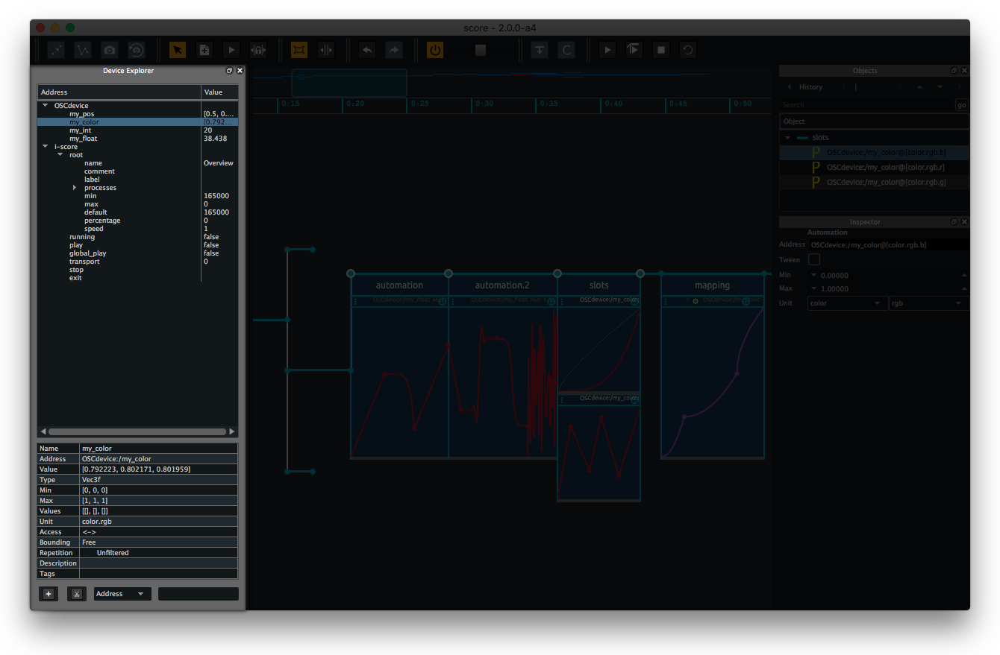
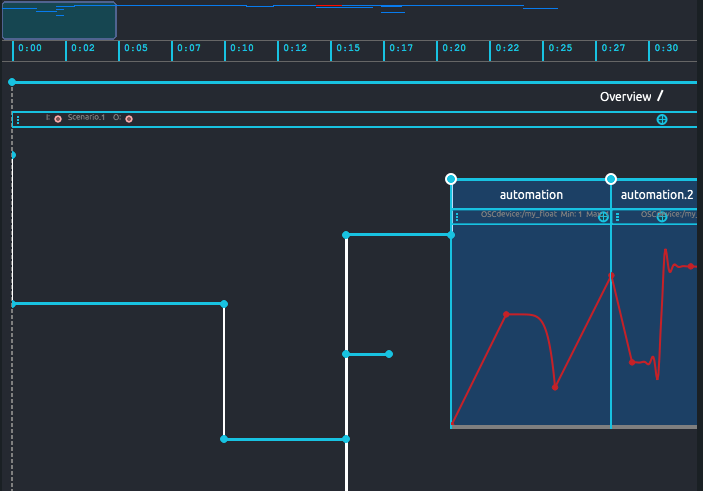

# Meet the Score interface

Here we will go through the various parts of Score's interface. Rather than going into each detail or advanced feature, we will first do a short run through of Score environment so you can feel at ease when going into deeper in the following tutorials.

As an example, we use here the demo scenario provided in the `Overview` folder. Feel free to open this scenario in Score as we explore core parts of the GUI as well as read the numerous comments added to it.

Once opened, Score provides a unique window embedding all main features and toolboxes. From it, you will be able to setup how your media applications and Score will communicate, observe their parameters value navigate through their namespace in a structured way, store some parameters value in snapshots, draw some automations, structure you scenario in flexible ways, etc. All can be done from one of the 3 UI areas:

* the Device explorer
* Score's timeline
* objects inspector

> Note that all main parts of Score GUI are dockable. Hence you may move them appart from main window using the button at the top right or by click+drag on their top bar. You can add them back by closing the detached window and toggling it back on in the `View > Windows` menu or use the `View > Restore layout` menu entry.

## Device explorer

First pane on the left of Score window is the *Device explorer* pane. As its name implies, this is where you can observe the state of the devices you want to control from your Score scenario. These devices may be media applications of pieces of hardware used in your project.

Devices are presented in the *Device explorer* as a tree-like list of all parameters declared in your application (the application namespace). Using our overview.scorejson demo file, you can see two devices here are declared: a dummy OSCdevice (that can be used with one of the provided Max/Pd patches, Processing sketch or Unity project) and Score itself (so it can be controlled from the scenario). Clicking one of the triangle widgets sitting next to the devices name unfolds the list of parameters declared in the controlled applications. Subsequently, each node can be fold/unfold to display or hide its child parameters. Clicking on an address node in the Device explorer also brings a handy inspector displaying the various attributes of this node (ie. Full address, value range, optional associated tags).

All parameters in your devices namespace display their current value in the Device explorer right column (assuming your device provides some mechanisms to echo back parameters state). You may even send some new value for a parameter by double-clicking and typing a new value in its value textfield. The Device explorer also provides an easy way to select some parameters from the namespace by clicking on a parameter name (or a range of addresses using shift + click or any addresses using cmd + click / ctrl + click) and drag them on the Timeline. Spoiler alert: you just created a snapshot in your scenario !

## Score Timeline

At the centre of the window is Score's Timeline. This is where you will actually write the scenario handling the commands sent to your devices as well as do some audio synthesis or processing and their organisation in time.

Without going into details in this chapter (following chapters will do so), as seen in the overview.scorejson file example, commands or processes sent to your devices are organized in time using a set of elementary objects:

* events: little blue dots with optional list of parameters values attached to it (white circle that is framing it)
* intervals: the horizontal blue lines connecting events that will stream time along the timeline
* processes: containers attached to an interval allowing some processes (ie. automation, mapping, custom js scripts) to operate over a dedicated time length

Again, following chapters in the documentation will go through each of these and their various toolboxes available. 

Score timeline also offers a synthetic view of the whole scenario at the top of the pane. From it you can zoom in/out in your scenario using click + drag up/down or navigate in your scenario using click + drag left/right.

## Object inspector

Last core element of Score window is the objects inspector. This area actually provides two inspectors

* The object inspector allowing to explore & select elements in your scenario structure (ie. events, intervals, trigger)
* The inspector allowing to display and edit parameters of the currently selected object (ie. state or process)

The object inspector at the top allows to select an object and see its hierarchical context. In the screen capture below, you will first see we can select each of the four events by selecting the sync bar connecting them, or display the processes attached to their parent interval.

You may also navigate through the structure of your scenario backward/forward or hierarchically using the four arrows above the list of objects as well as navigate through the history of recently selected objects.

The inspector below, allows to edit the various options of an object (ie. An event position on the timeline or an interval duration) and edit their attached content (ie. Addresses and values stored in a snapshot, automation's range or destination).

Of course, actual option fields of the Inspector are dynamic and depend on which object is currently selected. These options will get detailed in the following chapters of the documentation.

In the mean time, this should get us basis information to get us started writing our first scenario.