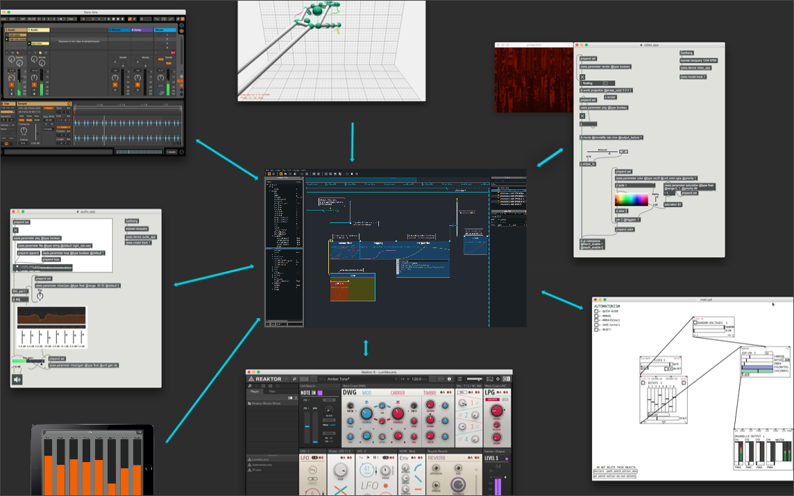

# Introduction

*Score* is an interactive sequencer for intermedia authoring. It allows to create flexible and interactive scenarios and is especially designed for live performance, art installations, museography or any context requiring a precise and interactive execution of timed events.

*Score* brings a flexible solution to the management and execution of events and their evolution in time. Modern DAWs now offer a number of tools to write precise automations along a timeline. However, as powerful as these are in the context of fixed-time media, such solutions are of little help when introducing interactivity in the execution of the produced scenarios. On the other hand, a number of software applications allow to trigger events in an interactive way, through a cue-based paradigm. However, these may not offer automation facilities as advanced as those found in modern DAW and also often rely on a sequential and linear triggering of events.

*Score* brings these two approaches together in an unified timeline. Scenario authoring and execution in *Score* thus make it possible to write fixed-timed automations as well as interactive sequences of automations. Most importantly, these two paradigms can be combined and used in parallel or hierarchically, which provides a high level of control and of openness, as is required by today’s creation.

## A sequencer for distributed media systems

Unlike other digital multimedia workstations, *Score* does not aim at being an all-at-once software. Instead, it is designed to fully integrate with dedicated software and hardware one already uses in their own personal workflow. 

While recent versions of *Score* allow to process media (such as audio), it takes its root as a remote controller allowing to store & recall snapshots and automations for some distant applications through various protocols ([OSCQuery](https://github.com/mrRay/OSCQueryProposal), [Open Sound Control](http://opensoundcontrol.org), [Midi](https://www.midi.org) or [Minuit](https://github.com/Minuit/minuit)). Hence it can easily be used in large setups involving video, audio and/or light software or hardware, in order to provide a unified and global solution to control parameters changes in a synchronous or asynchronous way across diverse applications and domains.

## *Score*'s features in a nutshell

This documentation will walk you through *Score*'s basis concepts and advanced features to ease the mastering of its features.

- Store & recall snapshots
- Use processes to write your application's parameters behaviour in time (BPF, interpolations, gradients)
- linearly organize snapshots & processes on the timeline
- trigger events interactively
- loops 
- branching scenarios

And more... 