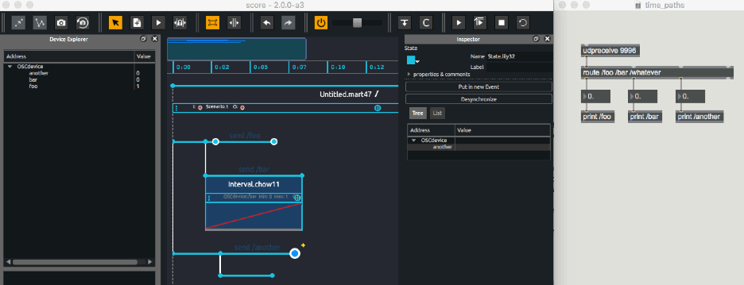
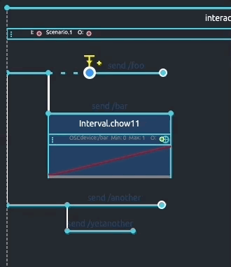

# Time approach in Score

A number of features offered in Score (ie. Snapshots, automations or interpolations processes) will most likely sound familiar to a number of users. However, as powerful and flexible the combination of fixed-time automations or interactive triggering of events is, it may be helpful to get a clear understanding of the time model that drove Score conception and induced workflow.

A useful metaphor to understand how time is managed in Score can be to envision *time as a stream flowing through the scenario written on the timeline*. Following this metaphor, Score thus provides a number of tools to define various paths on the timeline through which time will pass, to attach them events (snapshots or timed processes) that will get executed as time crosses them by, or to insert gates that will get opened or closed depending on various parameters (interactive triggering, branchings), etc.

## Let the time flow

When opening Score, user gets provided a blank scenario and its default time source. When clicking the play button (or pressing spacebar key), time will start spreading along the top timeline. You can see the green progress bar advancing along the top ruler displaying time in minutes:seconds.milliseconds. Plain and simple.

Rather than providing predefined tracks for example, Score offers to organize your distant application's parameters behavior on the timeline in flexible ways. Depending on your needs or workflow, you may write different paths by inserting  some events on the timeline, and connecting them using interval links (ie. Having paths dedicated to particular devices control or dedicating paths to different rooms of an installation).

When playing your scenario, you will see that *time flows through the various paths* as their progress bar moves forward.

> Note how important it is that various event paths are connected to the beginning of your scenario so they get executed following the timeline. You may think of these interval links between events as *feeder pipes*. They ensure that time will spread from the beginning of your scenario to the first attached event, then next one and so one. On the contrary, any event not connected to the beginning of your scenario or to another event will not get provided a time source: they will not get executed as time passes by.

## Open the floodgate !

One of Score's strength is the introduction of the time flexibility usually found in cue-based softwares with a timeline approach. Score hence provides different features to break or put on hold time flow through a path in your scenario or to write several versions of a path to be chosen during the execution of your scenario. 

First example here is what happens when adding a trigger to an event in your scenario. As time reaches this event, execution is put on hold until event is triggered, be it from a mouse click or when a particular value is sent from a remote software or sensor. Following our time flow metaphor, when done so, the *floodgate will get opened* and time will continue to flow down the path. Adjacent paths not set with a trigger will independently follow the general time flow.

The second mentioned example can be set when using conditions on events (ie. If a variable such as the distance between a user and a sensor is either smaller or greater than a particular threshold). When time reaches these conditional events, Score will check which conditions are true and choose which path(s) to execute. 

Of course as detailed later in this documentation, both interactive triggering and conditions can be used along with other features so you can get a precise control of time flow in your scenario.

## Cascading time flow

Using interval links between events in your scenario ensures that time will flow along the paths and trigger events or automations as they are reached. Yet another feature allows you to precisely control how time flows: hierarchical time flow. 

Each interval in a Score scenario provides a speed control allowing to adjust during the execution of your scenario how time will travel along the paths. This makes a very useful feature, in particular for live performance when you may want to slow down a particular process (ie. Light automation) a bit as the performer on stage takes more time to reach his new position, while not affecting automations controlling another process (e.g. sound spatialization). 

But the important point to note is that changing the speed of a given interval will also affect sub paths it is feeding time to, in a *cascading way*. You may think of this speed variable as an *adjustable tap at each feeder pipe input*. For example, when using sub-scenarios, changing the speed of the parent interval link will propagate to the whole scenario. On the other hand, changing the speed of an interval inside the sub scenario will only affect this interval and its attached events while the parent interval time will progress as written in the scenario.

## Out of time events

As explained above, events must get connected to a time source so they get executed as time progresses. When placed in Score’s timeline without a preceding interval connection, events are what we call *detached from the timeline* and their execution does not follow its progression. 

This can be extremely useful when you want to freely send parameters value or automation at any time in the execution of you scenario. 

> Note that these *detached events* then provide a time source and following events or automations will get executed as time progresses from this initial event.

