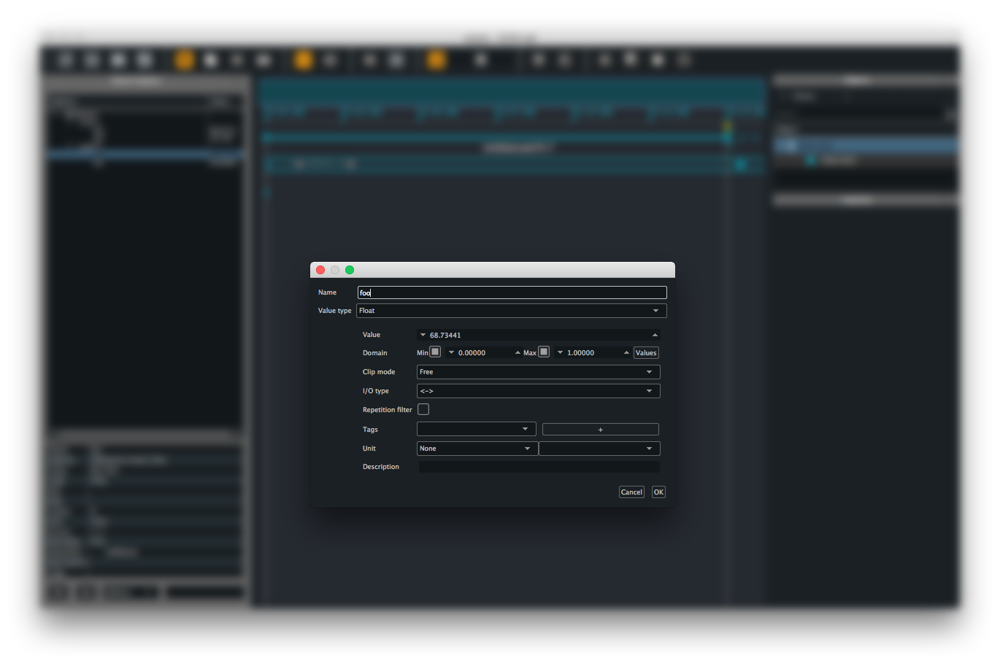

# How to manually declare a namespace ?

When not using Score with an application providing querying mechanism (such as OSCQuery) or echoing its parameters state, you need to manually add the parameter addresses to your device setup. Once having [setup an OSC device](../howtos/declare_an_osc_device.md), click on the device name and from the contextual menu, choose `Add child` to add an address at a level below. (you may as well choose `Add sibling` when right-clicking on a parameter name to add a parameter at the same hierarchical level)

This brings a configuration window for the parameter to declare in the namespace.

Score (along with some compatible protocols such as OSCQuery or Minuit) offers a number of attributes describing a parameter behaviour. Setting up these attributes allows to benefit from a number of Score handy features such as automatic value range setup when writing automations, repetitions filtering or unit conversion, to name a few.

These attributes are the following:

* Parameter name
* Type of value
* Default value
* Domain (range)
* Clip mode
* I/O type
* Repetitions filter
* Optional tags
* Unit
* Description

Please see [libossia documentation page](https://ossia.github.io/#node-and-parameter-attributes) for detailed explanation on these attributes.

Just fill these various optional attributes for the parameter to declare then click the `Ok` button. Freshly created parameter now appears in the Device explorer.

> Note that at the time of this writing, it is not possible to add in one go a parameter under several nodes (ie. `/foo/bar/my_parameter`). For the time being, you need to add the various nodes one at each time and set `container` as type. Then right-click on the created node and select `Add child` as many times as needed.

## Saving namespace as a file

When done adding the various parameters of your device, you can save the resulting namespace as a file for later use. Hence when working with this device in another project, you will be able to import the namespace when setting up the device and avoid the tedious manual namespace declaration above.

To do so, right-click on your device name, then from the contextual menu, choose `Export device`.