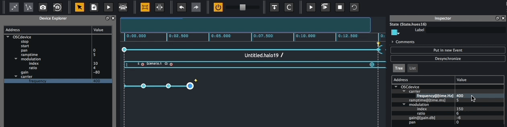

# How to update parameters value
## Using the refresh function

When using Score with a device providing bidirectional protocol such as OSCquery, Score listens to parameters changes in the controlled device. Stored states can then be updated by selecting the state to update on the timeline and click the 'Refresh state' button in the toolbar or use `cmd + u` on macOS or `ctrl + u` on Windows.

If your device can only receive messages from Score, in the Device explorer, double-click on a parameter's value textfield and type the desired value. Now lick the 'Refresh state' button in the toolbar or use `cmd + u` on macOS or `ctrl + u` on Windows.

## Using the inspector

Alternatively, stored states can be edited from a state inspector.

On the timeline, select the state to edit to display its inspector. From the tree view of the stored addresses and value, double-click on the value textfield and type the desired value.