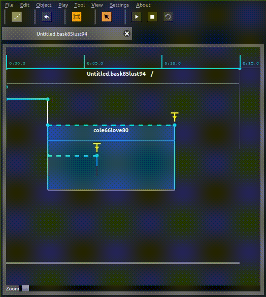

# Process overview: Loop

## Presentation

The loop is somewhat similar to the scenario.

It is a process that allows to loop other processes.

However no new structures can be created or removed in it.

It is built of :

* A first sync, event, and state
* A time constraint
* A last sync, event, and state

When created, it looks like this :

## Edition

The last event can be resized :

Processes can of course be added to the interval, as well as data to the states.

## Execution

The loop process, as its name tells, loops :

To make an infinite loop, one can for instance remove the maximum of its parent interval :

To make an interactive loop, a trigger can instead be added at the first or last trigger of the loop :

