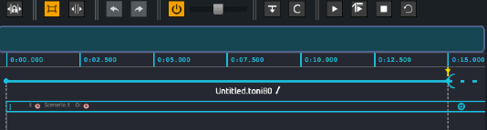

# Time approach in *Score*

A number of features offered in *Score* (ie. snapshots, automations or interpolations) will most likely sound familiar to a number of users. However, as powerful and flexible the combination of fixed-time automations or interactive triggering of events is, it may be helpful to get a clear understanding of the time model that drove *Score*’s conception and the design of its workflow.

A useful metaphor to understand how time is managed in *Score* can be to envision *time as a stream flowing through the scenario written on the timeline*. Following this metaphor, *Score* thus provides a number of tools to author complex scenarios : Various paths (through which time will flow) can be defined on the timeline. Events (snapshots or timed processes) can then be attached to those paths: they will execute as time crosses them by. Finally, gates can be inserted, that will get opened or closed in various ways (interactive triggering, branchings).

## Let the time flow

When opening *Score*, user gets provided a blank scenario and its default time source. When clicking the play button (or pressing spacebar key), time will start flowing along the top timeline. You can see below the green progress bar advancing along the top ruler displaying time in minutes:seconds.milliseconds. Plain and simple.

Rather than providing predefined tracks for example, *Score* allows to organize your distant application's parameters’ behavior on the timeline in flexible ways. Depending on your needs or workflow, you may write different paths by inserting  some events on the timeline, and linking them using intervals (ie. having paths dedicated to the control of particular devices, or dedicating different paths to different rooms of an installation).

When playing your scenario, you will see that *time flows through the various paths* as their progress bar moves forward.

> Note how important it is that all the event paths are connected to the beginning of your scenario so they get executed following the timeline. You may think of these intervals between events as *feeder pipes*. They ensure that time will spread from the beginning of your scenario to the first attached event, then to the next one and so one. On the contrary, any event not connected to the beginning of your scenario or to another event will not get provided a time source: they will not get executed as time passes by.

## Open the floodgate !

One of *Score*'s strength is the introduction of the time flexibility usually found in cue-based softwares with a timeline approach. *Score* hence provides two different ways to do this: by breaking or putting on hold the time-flow in a chosen path of a scenario ; or by writing several versions of a path to be chosen during the execution of your scenario. 

The first way to introduce temporal flexibility is to add a **trigger** to an event in your scenario. As time reaches this event, execution is put on hold until event is triggered, be it from a mouse click or when a particular value is sent or queried from a remote software or sensor. Following our time-flow metaphor, when done so, the *floodgate will open* and time will continue to flow down the path. Adjacent paths that are not set with a trigger will follow the general time flow independently.

The second way to introduce temporal flexibility is to set **conditions** on events (ie. if the value of a remote parameter such as the distance between an user and a sensor is either above or beyond a particular threshold). When time reaches these conditional events, *Score* will check which conditions are true and will choose which path(s) to execute. 

Of course as detailed later in this documentation, both interactive triggering and conditional execution can be used along with other features so you can get a precise control of time flow in your scenario.

## Hierarchical/cascading time flow

Using intervals between events in your scenario ensures that time will flow along the paths and will trigger events or automations as they are reached. Yet another feature allows you to add even more temporal flexibility, by precisely and continuously controlling the speed of the time-flow, in a hierarchical and cascading way. 

Each interval in a *Score* scenario provides a speed control allowing to adjust how time will travel along the paths during the execution of your scenario. This makes a very useful feature, in particular for live performance when you may want to slow down a particular process (ie. light automation) a bit as the performer on stage takes more time to reach his new position, while not affecting automations controlling another process (e.g. sound spatialization). 

But the important point to note here is that changing the speed of a given interval will also affect the sub-paths it is feeding time to, in a *cascading way*. You may think of this speed variable as an *adjustable tap at each feeder pipe input*. For example, when using sub-scenarios, changing the speed of the parent interval will propagate to the whole scenario it holds. On the other hand, changing the speed of an interval inside the sub-scenario will only affect this interval and its attached processes while the parent interval time will progress as written in the scenario.

## Out of time events

As explained above, events must be connected to a time source to be executed as time progresses. When placed in *Score*’s timeline without being connected to a preceding interval, events are what we call *detached from the timeline* and their execution does not follow its progression. 

This can be extremely useful when you want to freely send parameters value or automation at any time in the execution of you scenario. 

> Note that these *detached events* then provide a time source and following events or automations will get executed as time progresses from this initial event. Also, in contrast to other usual scenario elements, detached events and event-interval compounds can be triggered repeatedly.

