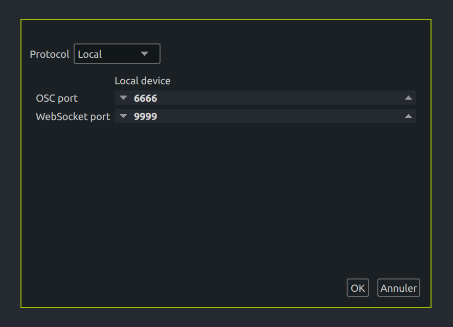
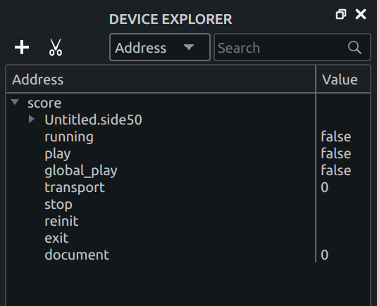
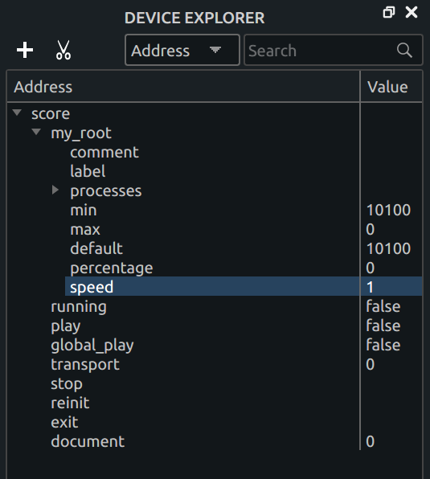

# How to control the execution speed of score externally ?

Score allows to control the execution speed of any interval, either through the user interface, 
or through the local tree. 
To do so, add a device, and select `Local` in the protocol chooser.

An OSCQuery device is created, with the ports chosen in the device window.
Its parameters can be seen in the device explorer.

The most relevant parameters are the following : 

* `/running` : true if score is currently playing, false if not.
* `/play` : play or pause the interval currently in full view.
* `/global_play` : play the whole score.
* `/transport` : move the execution at the given time (in milliseconds).
* `/stop` : stop the execution.
* `/reinit` : stop the execution and launch the first state.
* `/exit` : quit the score process.
* `/document` : switch score to another document if multiple documents are open.

> Warning: quitting Score with `/exit` won't ask you to save if there are modifications ; it is to be used in case of emergency only.

In addition, the local tree contains the root interval object, which has a few properties.

The property most relevant to transport here is the speed control.
For instance, to halve the global execution speed, one would send the OSC message 

    /my_root/speed 0.5
    
to the UDP port 6666 (or directly through OSCQuery if available).

> The local tree can be disabled in the settings, which will cause the root interval (and its children) to be absent from it. This can be useful on low-power systems since the local tree can require some CPU resources.
